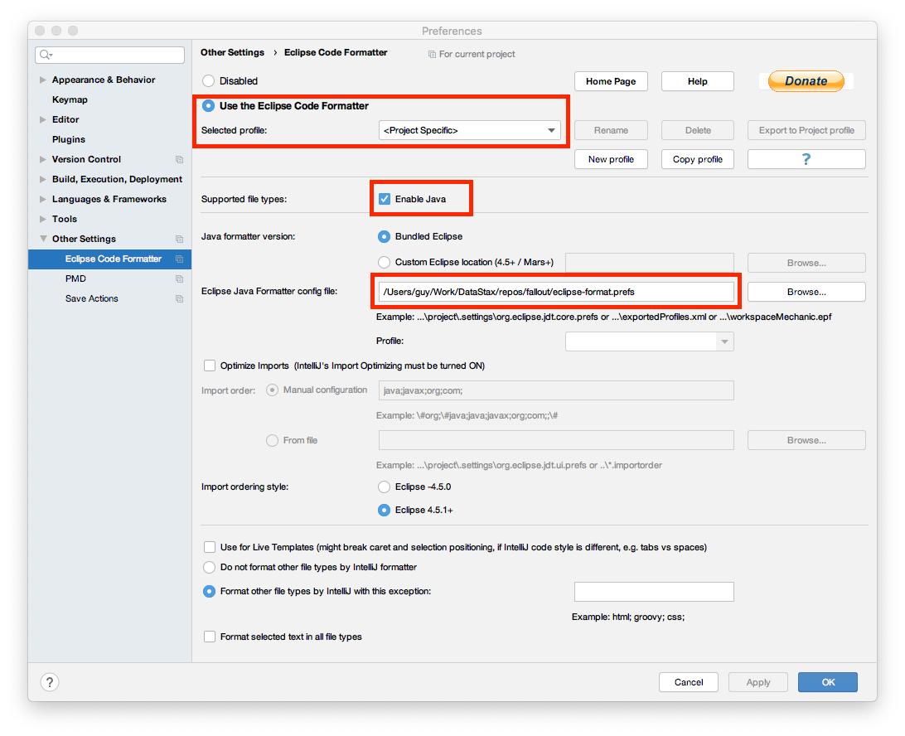
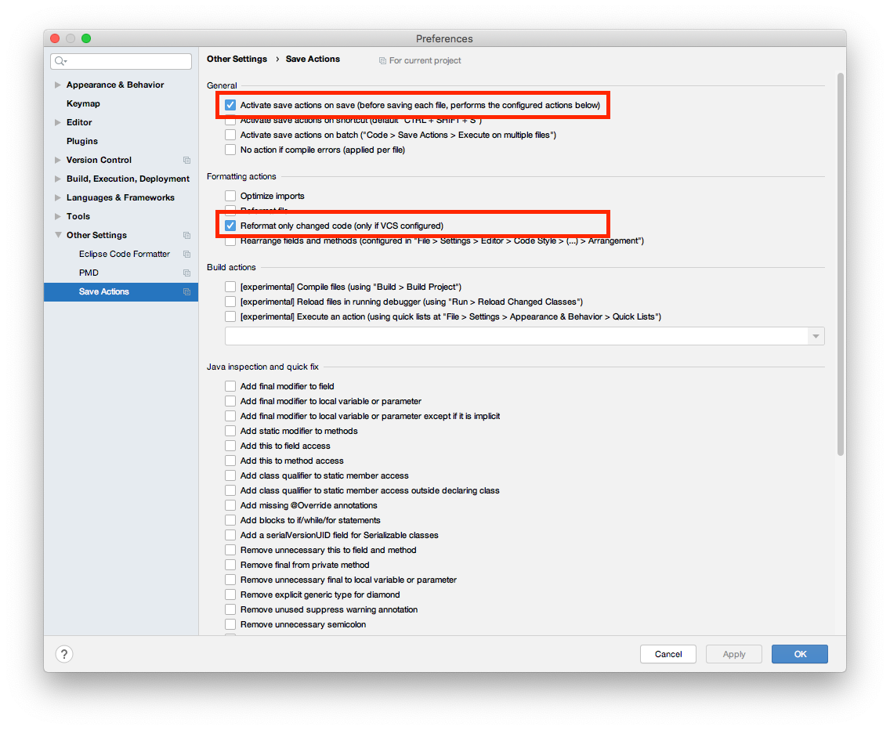
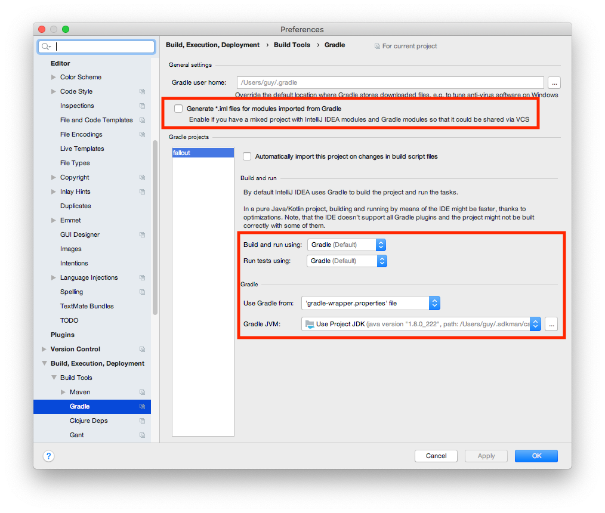

# Contributing to Fallout

## Architecture

If you want to understand the internals of the queueing and running mechanism, there's a [class collaboration sketch here](docs/assets/TestRunner-collaborators.png); there's also a [collaboration sketch for the LiveLog here](docs/assets/LiveLog-collaborators.png).

There is also a [sequence diagram to show how the separate QUEUE and RUNNER processes interact here](docs/assets/queue-server-lifetime.png).

All of the above diagrams are generated from `.dot`/`.plantuml` files in [docs/assets](docs/assets) by the gradle `docs` task.

## Making Changes

### Common Gotchas

- When adding `PropertySpec`s to a component, make sure they're returned in `getPropertySpecs()`.

- When writing code that needs the IP of a `Node`, prefer using `Utils.getContactPoints()` to get the appropriate IP addresses, as this will correctly give you the private or public IP to use, instead of using `Node.getPublic/PrivateAddress` directly.

- When writing a `Module.run` method that doesn't just run something via `Node.execute()` (the abort mechanism will handle this for you), consider making it periodically check `Module.isTestRunAborted` so that it can be aborted.

- If you need to wait on the results of several `Node.execute()` commands on multiple nodes, use the `Utils.waitFor*` methods;

- The following `NodeResponse` methods can block until a process has started (depending on the Provisioner in use, this may be a non-trivial amount of time): `getOutputStream`, `getErrorStream`, `getExitCode`.  You shouldn't need to call the first two, and you should only call `getExitCode` after a NodeResponse `isCompleted` (calling it before can raise an exception, depending on the Provisioner in use).  Rather than calling these methods directly, use the `NodeResponse` and `Utils` `waitFor*` methods to log output and check for completion.

### Code Style

This is enforced by `spotless` and `ktlint`, with the settings held in `.editorconfig` for `ktlint`, and in the `spotless` config blocks in `build.gradle` in fallout-oss and fallout-ds, which in turn import `eclipse-format.prefs`.

See the [code style section under Using IntelliJ IDEA](#code-style-1) for how to make IDEA auto-format using the above settings.

### Assertions

Please do not use raw Java `assert`; use the methods provided by Guava's `Verify` and `Preconditions` in production code, and use AssertJ's `assertThat` in test code:

* In production code:
    * Use `Verify.verify` and `verifyNotNull`.
    * Bonus points: if you have something that is unambiguously a precondition, then feel free to use `Preconditions.checkArgument/checkState/checkNotNull`.  Hint: it's not a precondition if it's not at the beginning of a method.  But really, `Verify` is fine.
* If you're writing a test:
    * Use `AssertJ`'s `assertThat` (note this is _not_ the `assertThat` from junit).

## Submitting Code

- Make sure you run `./gradlew lint` to make sure your code at least compiles and passes style checks before pushing (the [git hooks](#git-hooks) described below will do this for you).
  - If the `spotlessCheck` or `ktlint` tasks in any of the projects fail, the error message will tell you what task to run to fix the problem.
- Submit change requests via the Github Pull Request workflow.
- GitHub Actions will build and test your branch.

### Git hooks

Some useful git hooks will be installed by running `./gradlew setupGit` (you can safely run this as many times as you like); to get the full advantage of these, you should install `shellcheck`.  The `shellcheck` is not currently enforced by CI, but everything else is; if you have modified something that wasn't already shellcheck-clean, and you just want to check it in, use the `--no-verify` flag with `git commit`.

To prevent leaking secrets, the `setupGit` task will also run [git secrets](https://github.com/awslabs/git-secrets) to configure a default set of patterns.  If you haven't already installed `git-secrets` then you should do so, and run `setupGit` again.

### Reviewing

All PRs need a reviewer's +1.

### Delivering PRs

- If your change is a single commit, or multiple commits that you don't think are worth keeping in the history, please [squash-and-merge](https://help.github.com/articles/about-pull-request-merges/#squash-and-merge-your-pull-request-commits).

- If your change is multiple commits and you _do_ think they're worth keeping in the history, please perform a plain merge.

- If you have a separate commit with a failing test because you've TDD'd the solution into existence, please squash the failing test into a commit where it passes (there should be no _intentional_ commits that fail test, since this makes bisecting impossible).

- Note that [rebase-and-merge](https://help.github.com/articles/about-pull-request-merges/#rebase-and-merge-your-pull-request-commits) is disabled on the fallout GH repo; the rationale is that there's no option to put in a sensible commit message, and the commits can't easily be traced back to the PR issue (see below).

## Using IntelliJ IDEA

This is based on IDEA version 2019.3.

### Code Style

The `./gradlew spotlessCheck` task uses the eclipse formatting settings in `eclipse-format.prefs` to enforce a consistent format (we use the eclipse formatter because there's no support for running the IDEA formatter in CI).

Settings for IntelliJ that closely match this are in `.editorconfig`, to provider formatting while-you-type.  In `Settings >  Editor > Code Style` make sure `Enable EditorConfig support` is checked.  These settings only closely match, though: continuation indentation behaviour differs.

To ensure `./gradlew spotlessCheck` passes without having to run `./gradlew spotlessApply`, you can use the following plugins and settings to make IntelliJ correctly format your code when you save a file:

* Install the [Eclipse Code Formatter](https://plugins.jetbrains.com/plugin/6546-eclipse-code-formatter) plugin
* Install the [Save Actions](https://plugins.jetbrains.com/plugin/7642-save-actions) plugin
* Restart the IDE

* Open `Settings`, navigate to `Other Settings > Eclipse Code Formatter`, and apply the following settings:

   

   ...i.e.:

   * `Use the Eclipse Code Formatter` is on;
   * `Enable Java` is on
   * The `eclipse-format.prefs` in your checked-out fallout repo is selected as the `Eclipse Java Formatter config file`.

* Navigate to `Other Settings > Save Actions`, and apply the following settings:

   

   ...i.e.:

   * `Activate save actions on save` is on;
   * `Reformat only changed code` is on.

### Importing as a project or module

* Import `build.gradle` as a gradle project or module.  You can safely ignore any messages about `Duplicate content roots detected`.

* Open `Project Structure...`, and make sure a Java 17 Project JDK is set.

* Open `Settings`, navigate to `Build, Execution, Deployment > Compiler > Annotation Processors`, and make sure the `Enable annotation processing` checkbox is checked:

    

* Then. navigate to `Build, Execution, Deployment > Build Tools > Gradle` and make sure that the settings are as follows:

    

    ...i.e.:

    * `Generate *.iml files for modules imported from Gradle` is off;
    * `Build and run using` and `Run tests using` are both set to `Gradle`;
    * `Use Gradle from` is set to `'gradle-wrapper.properties' file`;
    * and `Gradle JVM` is `Use Project JDK`.

* In the toolbar drop-down at the top of the main window, select `Edit Configurations...`, go to `Templates > Gradle`, and set the `Environment Variables` as follows (click `[=]` button):

    * `JAVA_HOME`: the installation of the Java 17 JDK
    * `JAVA8_HOME`: the installation of the Java 8 JDK

    In order to run the full suite of unit tests, these must also be set:
    * `UNIT_TEST_GOOGLE_SERVICE_ACCOUNT_JSON_FILE`: (path to your Google Cloud service account json key file)

* To run the fallout server, open the Gradle panel, navigate to `fallout > Tasks > application` and double-click `runServer`.

### Known issues

Until [KTIJ-19483](https://youtrack.jetbrains.com/issue/KTIJ-19483) is fixed, IDEA will show incorrect syntax errors in the [build-logic](build-logic) code.  A (not very satisfactory) workaround is to edit each build-logic sub-project in its own IDEA project.
