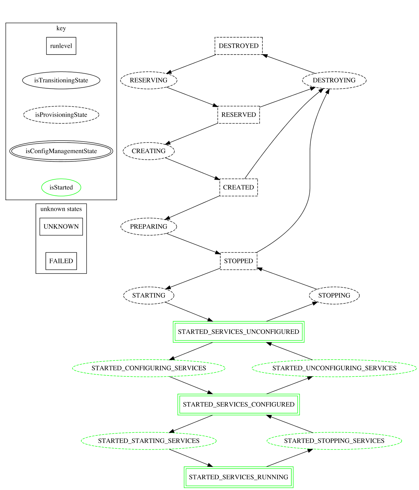

# Fallout Operations

Fallout's purpose is to run large scale tests and expose bugs. In order to do that it needs a way to describe, provision, configure, interact with, and tear down clusters of machines and services.  Furthermore, since environments and tools are heterogeneous we must define a unified api to wrap these things and make them easily extendable.  This section describes Fallouts approach to creating and using clusters of machines and services.

This API lives under the [com.datastax.fallout.ops package](../src/main/java/com/datastax/fallout/ops)

Most operations in the API are asynchronous, returning a **[CompletableFuture](https://docs.oracle.com/javase/8/docs/api/java/util/concurrent/CompletableFuture.html)< Boolean >** to identify success or failure.

## Ensembles, NodeGroups and Nodes

Fallout abstracts logical resources and services using the abstractions of Ensembles, NodeGroups and Nodes.

Working backwards a '[Node](../src/main/java/com/datastax/fallout/ops/Node.java)' is a resource with services running on it.
Actions on nodes include:
- Executing commands with access to stdout and stderr streams.
- Provides programmatic access to running services using the Provider API.

A '[NodeGroup](../src/main/java/com/datastax/fallout/ops/NodeGroup.java)' is a set of nodes all part of the same logical service. Example a cassandra cluster. NodeGroup is the central abstraction for moving through the ops lifecycle (more on this below).

An '[Ensemble](../src/main/java/com/datastax/fallout/ops/Ensemble.java)' is a set of NodeGroups, each with a defined Role.

````
        SERVER,    //Represents a distributed service like Cassandra
        CLIENT,    //Represents a service user like cassandra-stress
        OBSERVER,  //Represents an observer like OpsCenter/Graphite
        CONTROLLER //Represents an external controller like Jepsen
````

Using these abstractions a test writer can reason about how to interact the majority of cluster setups.

## Understanding the Fallout Lifecycle

The state lifecycle is central to the Fallout Ops API. It gives us a clear way to identify what state a NodeGroup is in and a way to transition between states programmatically.

There are three categories of States:

- Unknown States
- Transitional States (used when a node group is moving from one state to another)
- Runlevel States (steady states that can be transitioned to.  Modelled after [runlevels in unix](https://en.wikipedia.org/wiki/Runlevel))



(The above was generated using the `docs` gradle task; please update it if the states ever change!)

State transitions perform provisioning and configuration actions. These actions should only ever be performed on entire node groups.

State transitions are performed in two parts. Coordinating transitions and setting the state values of node groups is performed by the NodeGroup API. The actions performed during a transition are part of the Provisioner and Configuration Manager APIs.

**NodeGroup.getState()** shows you the current state a node group is in.

State transitions should always be initiated through the **NodeGroup.transitionState()** method. Passing in a runlevel state will move a NodeGroup to that state from their current state.

Any errors encountered during these transition will put the node group into the **FAILED** State.

To verify the state of a node you can call **NodeGroup.checkState()**  This will inspect the node and return the state it sees.

## Provisioners

In Fallout a '[Provisioner](../src/main/java/com/datastax/fallout/ops/Provisioner.java)' is responsible for creating, starting, stopping, executing on, and destroying node groups.

Provisioners are used directly by the NodeGroup class.  Users don't deal with them other than their configuration.

The goal is for it to be possible to wrap any provisioner with this API.

Provisioners are self-describing and self-validating by way of defining provisioner properties.  Folks who wish to write their own provisioners can read more about this approach called a [PropertySpec](../src/main/java/com/datastax/fallout/ops/PropertySpec.java) in the [extending Fallout document](extending.md)

## Configuration Managers

The [Configuration Manager](../src/main/java/com/datastax/fallout/ops/ConfigurationManager.java) class (or CM) are designed just like Provisioners except they deal with configuring/unconfiguring software and starting/stopping services.

CM are also responsible for registering Providers with nodes. More on that in the next section.

A list of all Configuration Managers can be found by searching the code for `@AutoService(ConfigurationManager.class)`.

## Providers

A [Provider](../src/main/java/com/datastax/fallout/ops/Provider.java) provides access to information, a service, or a tool via an API for use downstream by the test harness.  Providers let us abstract details about a service specific to a platform or setup.

Providers can be accessed via the **Node.getProvider()** method. For example, in order to access the NoSqlBench Provider, one can use **Node.getProvider(NoSqlBenchProvider.class)**.
**Node.getProvider()** will raise a RuntimeException if the node does not have available the given Provider.
To test for the availability of a Provider use **Node.maybeGetProvider()** and examine the Optional you get back. 

When implementing a Provider that requires another Provider at runtime you should implement **Provider.getRequiredProviders()** accordingly.
This means the Providers need to be added to a node in the right order (usually handled by the Configuration Manager).

Most providers can be found in the [ops/providers package](../src/main/java/com/datastax/fallout/ops/providers). The rest are co-located with their matching ConfigurationManager and Module in subpackages in the [harness/modules package](../src/main/java/com/datastax/fallout/harness/modules).
