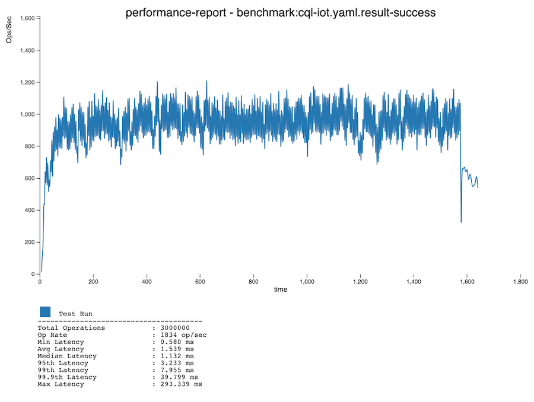
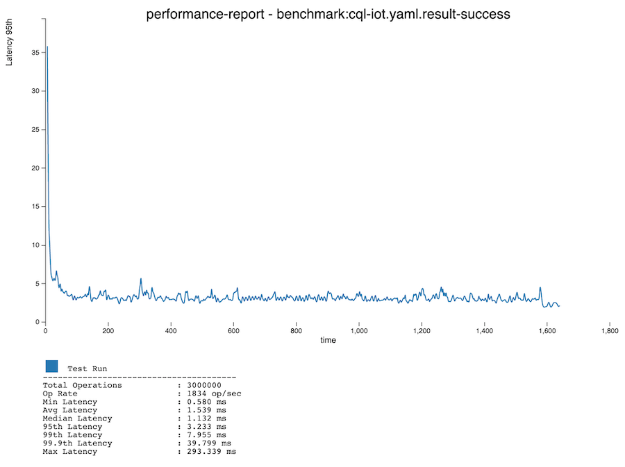
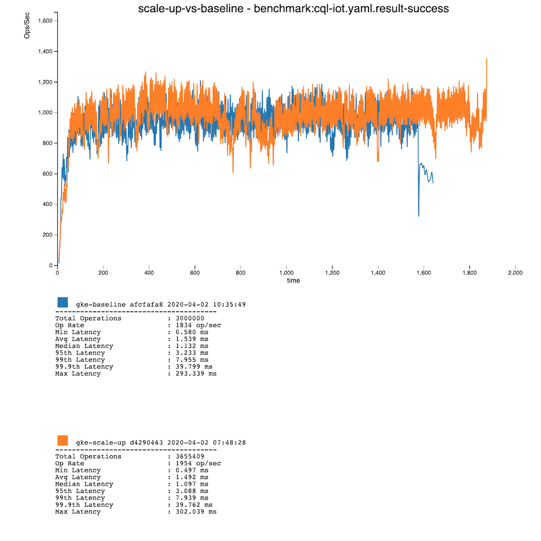
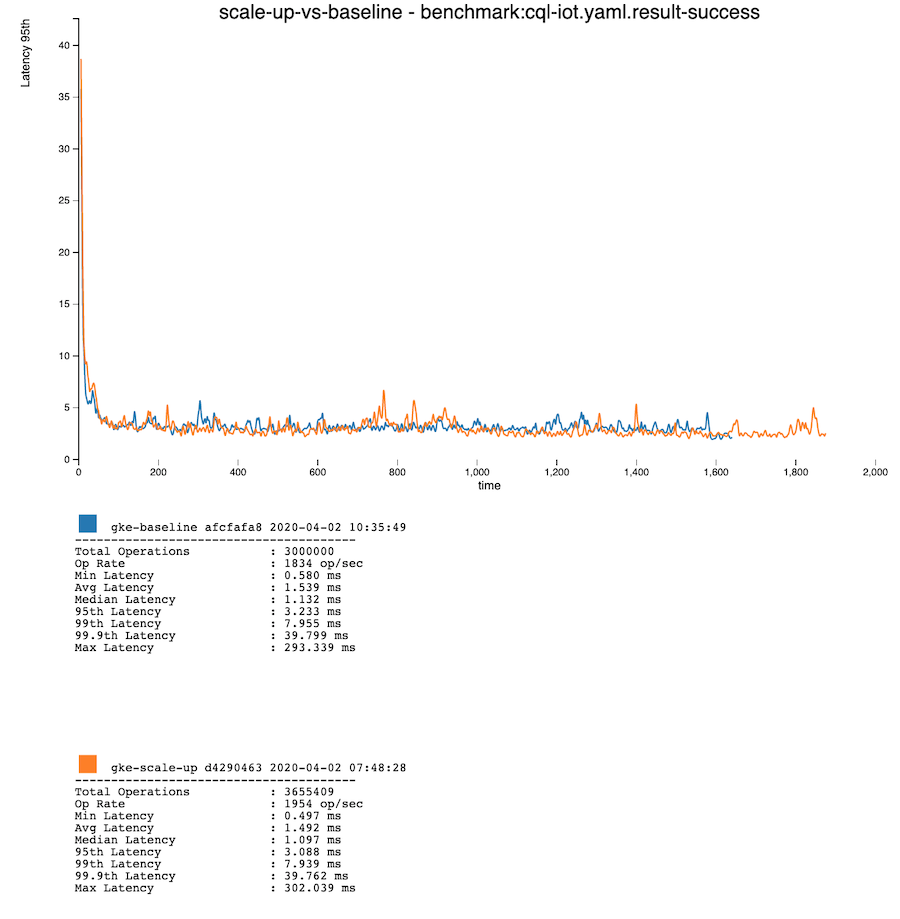

Benchmarking the DataStax Cass-Operator on GKE
==============================================

This is a short introduction to creating performance benchmarks using Fallout, NoSQLBench, and the DataStax Cass Operator. We'll start with the basics, then introduce a simple operational procedure to see how it affects performance.

This guide assumes you have access to a GKE project with a VPC setup.

Don't have access to GKE? Fallout is also able to run KIND (Kubernetes IN Docker) locally. This is good for getting your feet wet, but lacks the capacity for serious benchmarks or operations. Fallout has an [example test yaml](../../src/main/resources/com/datastax/fallout/service/resources/server/default-test-definition.yaml) which spins up a one node KIND cluster and runs a short benchmark. For the most part, it is possible to follow along with this guide using the default KIND based test.

#### Prerequisites
Before you get started, make sure you:
- are able to run Fallout in development mode ([Getting Started](../../README.md#Getting Started))
- have enabled Fallout access to GKE:
    - Create a service account ([Creating and managing service accounts](https://cloud.google.com/iam/docs/creating-managing-service-accounts))
    - Export the service account json key file from the console ([Creating and managing service account keys](https://cloud.google.com/iam/docs/creating-managing-service-account-keys))
    - Add the json key to your [Fallout user profile](http://localhost:8080/account)

## Defining A Simple Benchmark

A Fallout test is defined in two main components, an ensemble and a workload.
The ensemble represents the entire distributed system to test, consisting of one or many node groups with different roles. Node groups are created by a Provisioner, contain one or many nodes, and run one or many services defined by Configuration Managers. For a full explanation of the ensemble, see the [operations doc](../../docs/operations.md).
The workload is a sequence of Modules which perform a specific parameterized action. This sequence of module executions, called Phases, can run in sequentially or in parallel and be infinitely nested. For a full explanation of the workload, see the [testing doc](../../docs/testing.md). 

Our simple benchmark is going to run against an ensemble consisting of a single node group on GKE containing three worker nodes, running three NoSQLBench pods and a three node cass-operator managed cluster. The workload will be a simple invocation of a NoSQLBench activity, simulating client queries against the C* cluster. Feel free to take a look at the [test definition](gke-baseline.yaml) in full now. Don't worry if it doesn't make sense yet, we'll go through it component by component starting at the top and working our way down.

#### Templated Parameters

Fallout offers the ability to template tests using [Mustache](https://mustache.github.io/), defined as a seperate yaml document. This is especially useful for quickly changing parameters and ensuring consistency between repeated instances of a parameter. In our test we have:
```yaml
cql_iot: cql-iot.yaml
namespace: cass-operator
warm_up_cycles: 100K
benchmark_cycles: 1M

## These parameters must be supplied:
gke_project:
vpc:              # for example: "projects/<PROJECT_NAME>/global/networks/default"
regional_network: # for example: "projects/<PROJECT_NAME>/regions/us-west2/subnetworks/default"
```
The template parameters doc is a simple map, where the keys are the anchors to be used by Mustache and the values are the default parameters for the test. The parameters can be updated for any single test run just before submission using an editor window on the test run's page. See the [templating doc](../templating) for more.

We'll call back to these parameters as we encounter them in throughout the test definition.

#### Ensemble and Node Groups

The ensemble is defined as a map of node group role lists containing node groups serving in those roles. Most commonly we are only interested in a single node group for a specific role, so we have created a shortcut for this. Node groups can also be linked to each other, in cases where a single node group is serving multiple roles. Our test makes use of both conventions:

```yaml
ensemble:
    server:
        node.count: 3
        provisioner:
        ...
        configuration_manager:
        ...
        local_files:
        ...
    client: server # links the client role to the server group
```

Here we have defined an ensemble with one node group serving as both a server and a client.

For more information on multiple node groups of the same role, see the [multiple nodegroups doc](../multiple-nodegroups/README.md).

This snippet also includes a sub-set of the node group top-level keys. Of these `node.count`, `provisioner`, and `configuration_manager` are always required. However, when dealing with Kubernetes `local_files` are required in order to supply the yaml resources for Fallout to apply.

#### Provisioner

A node group can define a single provisioner. Let's look closer at the provisioner for our test:

```yaml
        provisioner:
            name: gke
            properties:
                project: {{gke_project}}
                region: us-west2
                machine.type: n1-standard-2
                create.extra_args: |
                    --cluster-version "1.15" \
                    --image-type "COS" \
                    --enable-ip-alias \
                    --no-enable-basic-auth \
                    --network "{{vpc}}" \
                    --subnetwork "{{regional_network}}"
```

The `name` field defines which provisioner will be used to create this node group, and each provisioner accepts a specific set of properties. All Fallout components are self documenting, and hosted on the running Fallout server itself. In this case, `localhost:8080/components/provisioners#gke`. If you are familiar with GKE, you will recognize these properties and their values. All of the choices here are fairly simple, opting for a cost-effective easy to use cluster. 

Note `project`, `--network`, and `--subnetwork` are using template parameters from above. Since these values are specific to you, we have not included defaults.

#### Configuration Managers

Configuration managers are used to install and configure various services within our node group. Our test defines three:

```yaml
        configuration_manager:
            - name: kubernetes_manifest
              properties:
                  namespace: {{namespace}}
                  manifest: <<file:gke-storage.yaml>>
                  wait.strategy: FIXED_DURATION
                  wait.timeout: 30s

            - name: nosqlbench
              properties:
                  namespace: {{namespace}}
                  replicas: 3

            - name: ds_cass_operator
              properties:
                  namespace: {{namespace}}
                  operator.manifest: <<file:ds-cass-operator-v1.yaml>>
                  datacenter.manifest: <<file:size-templated-minimal-cass-3.11.6-dc.yaml>>
                  datacenter.template_params:
                      size: 3
```

The `kubernetes_manifest` configuration manager is responsible for applying the supplied `gke-storage.yaml` to our Kubernetes cluster within the given `namespace`. Here we are using the `kubernetes_manifest` configuration manager as a way to supply the kubernetes cluster with any resources required by other components, namely the StorageClass for the `CassandraDatacenter`. While running the Fallout server, see the [kubernetes_manifest component docs](localhost:8080/components/configurationmanagers#kubernetes_manifest).

Fallout only allows a single configuration manager of a specific type per node group. Thus, using the `kubernetes_manifest` to deploy prerequisite resources we must combine all of the requires resources into a single multi-doc yaml. Our test isn't affected by this, as it is only deploying a single StorageClass, but more complicated setups likely will run into this.

Next, the `nosqlbench` configuration manager creates a three replica [Deployment](https://kubernetes.io/docs/concepts/workloads/controllers/deployment/) each running a NoSQLBench container. The pods created by this Deployment have an anti-affinity which results in each pod residing on a node alone. This configuration manager will handle collecting logs and HDR artifacts from NoSQLBench activities. More on those later. While running the Fallout server, see the [nosqlbench component docs](localhost:8080/components/configurationmanagers#nosqlbench).

Finally, the `ds_cass_operator` configuration manager is responsible for the DataStax cass-operator. The `ds-cass-operator-v1.yaml` contains all of the Kubernetes components required to deploy the operator. The `size-templated-minimal-cass-3.11.6-dc.yaml` defines a `CassandraDatacenter`. While running the Fallout server, see the [ds_cass_operator component docs](localhost:8080/components/configurationmanagers#ds_cass_operator).

As the name implies, the data center is templated (also with Mustache) which is feature of Fallout. This allows us to reuse a single data center definition to resize the data center.

A current limitation of the `ds_cass_operator` configuration manager is it requires the datacenter manifest explicitly set the `serverImage`.  

Note `namespace` is parameterized using a template variable from before. This helps ensure all of our Kubernetes resources end up in the same namespace.

#### Local Files 

The final component of our node group supplies Fallout with external resources which can be used during the test.

```yaml
        local_files: # required for kubernetes manifests
            - url: https://raw.githubusercontent.com/datastax/fallout/master/examples/kubernetes/datastax-cass-operator-resources/gke-storage-class.yaml
              path: gke-storage.yaml

            - url: https://raw.githubusercontent.com/datastax/fallout/master/examples/kubernetes/datastax-cass-operator-resources/ds-cass-operator-v1.yaml
              path: ds-cass-operator-v1.yaml

            - url: https://raw.githubusercontent.com/datastax/fallout/master/examples/kubernetes/datastax-cass-operator-resources/size-templated-minimal-cass-3.11.6-dc.yaml
              path: size-templated-minimal-cass-3.11.6-dc.yaml
```

Local Files is a list of `FileSpec`. All of the external resources used in this test have been co-located within this repo, but that is rarely the case. See the [managed files doc](../managed-files) for more details on how Fallout utilizes externals resources and the different types of `FileSpec`.

With that, we've finished defining our ensemble! Take a moment to go back to the [full test definition](gke-baseline.yaml) to review it as a whole.

#### Workload 

As mentioned above, workloads are a sequence of phases which can be run sequentially or in parallel. This can produce very complex test scenarios, but for our purposes we can keep things simple:
```yaml
workload:
    phases:
        - init_schema:
              module: nosqlbench
              properties:
                  num_clients: 1
                  args:
                      - run
                      - type=cql
                      - yaml={{cql_iot}}
                      - tags=phase:schema
                      - rf=2
        - warm_up:
              module: nosqlbench
              properties:
                  cycles: {{warm_up_cycles}}
                  args:
                      - run
                      - type=cql
                      - yaml={{cql_iot}}
                      - tags=phase:main
                      - errors=histogram
        - benchmark:
              module: nosqlbench
              properties:
                  cycles: {{benchmark_cycles}}
                  args:
                      - run
                      - type=cql
                      - yaml={{cql_iot}}
                      - tags=phase:main
                      - errors=histogram
``` 

Our workload consists of three sequential, single module phases. Each phase invokes the `nosqlbench` module with a specific purpose in mind, as reflected by the phase names. If you are unfamiliar with the NoSQLBench project, check out it's [docs site](http://docs.nosqlbench.io/#/) or [GitHub repo](https://github.com/nosqlbench/nosqlbench).

In all of our invocations we are using the built-in [cql-iot.yaml](https://github.com/nosqlbench/nosqlbench/blob/1c05974ffab3ceb807e60b0f612254cc1503fc70/activitytype-cql/src/main/resources/activities/cql-iot.yaml) NoSQLBench activity, defined in our template params. This yaml activity is all we need to define a data model and simulate real client queries against our cluster. 

Let's take a quick look at the key parts we're making use of from that activity. In order:
- `init_schema` executes the statements tagged with `phase:schema`. This creates the `baselines` keyspace and `iot` table. Note, the `rf` parameter sets the replication factor for the keyspace, which uses `SimpleStrategy` by default. For this phase we only use a single client to execute the creates. Strictly speaking, this isn't necessary because the create queries include `if not exists`, but it is a good practice. 
- `warm_up` is a short read/write workload defined by the statements tagged with `phase:main` which gives the JVM a chance to self-tune.
- `benchmark` is the real meat

Fallout manages some arguments for NoSQLBench, and allows others to be set or unset by the user. NoSQLBench has powerful defaults, and often it is acceptable to rely on these. Notably, the `cycles` argument is handled by Fallout, which distributes the given value in equally sized cycle ranges across all `nosqlbench` replica. For example, with three replica and `cycles: 60` each replica will be give 20 cycles to execute: `0..20`,`20..40`,`40..60`. In addition to `cycles` (at the time of writing) Fallout also manages:
- `host`: targeting ds-cass-operator clusters in the same namespace
- `--log-histograms` & `--log-histostats`: producing artifacts which can be processed by Fallout 
- `-v`: to ensure we capture all information about the NoSQLBench run.

Each of these phases will produce a log of the NoSQLBench run and HDR files characterizing the performance as measured by NoSQLBench during the run.

#### Checkers

Our test has two checkers:
```yaml
workload:
    phases:
        ...
    checkers:
        nofail:
            checker: nofail
    artifact_checkers:
        hdr:
            artifact_checker: hdrtool
```

The `nofail` checker is straightforward: it reads the jepsen-history.log and ensure no module emitted a failure. Fallout also always adds a `noerror` checker. For clarification on the difference between `fail` & `error` see the [testing doc](../../docs/testing.md).

What's really interesting for our test is the `hdrtool` artifact checker. This checker will find all the HDR files produced by our `nosqlbench` modules, union the related metrics across clients, and produce a performance report giving us a wholistic view of the C* clusters performance.

For example, here is the ops/second of our benchmark:



Here is the 95th percentile latency:




#### Collected Artifacts

Configuration managers are also responsible for collecting artifacts produced by their services. In our test, the `nosqlbench` configuration manager will collect the logs & HDR artifacts from all of our NoSQLBench runs. The `ds_cass_operator` will collect the system logs from the C* pods present at the end of the test run. Currently, if a pod is evicted or dies the system logs will be lost.

## Introducing Operations

Most Fallout tests don't just run a benchmark. Instead we're interested in how the system under test behaves while it is being operated against or experiencing some failure scenario. A simple operation we can introduce to our test is scaling up the CassandraDatacenter. Scaling up is as easy as increasing the `size` property of the `CassandraDatacenter` CRD.

We'll have to change a few things about our test setup. In the `gke` provisioner, we'll need to setup the autosclaer by adding
```yaml
                    --enable-autoscaling \
                    --min-nodes 1 \
                    --max-nodes 2
```
to the `create.extra_args`. The min/max values here apply to the number of nodes within a zone.

We'll also need to update our local files, replacing the `size-templated-minimal-cass-3.11.6-dc.yaml` with two new instances of the file:
```yaml
            - url: https://raw.githubusercontent.com/datastax/fallout/master/examples/kubernetes/datastax-cass-operator-resources/size-templated-minimal-cass-3.11.6-dc.yaml
              path: initial-size-templated-minimal-cass-3.11.6-dc.yaml

            - url: https://raw.githubusercontent.com/datastax/fallout/master/examples/kubernetes/datastax-cass-operator-resources/size-templated-minimal-cass-3.11.6-dc.yaml
              path: scaled-size-templated-minimal-cass-3.11.6-dc.yaml
```

This is because Fallout will only ever render a single version of a templated manifest. We'll be rendering two different versions of the file: one with the initial size of 3, and another with our scale up size of 6.

Finally, we'll have to modify our `benchmark` phase:
```yaml
        - benchmark:
              module: nosqlbench
              properties:
                  cycles: {{benchmark_cycles}}
                  args:
                      - run
                      - type=cql
                      - yaml={{cql_iot}}
                      - tags=phase:main
                      - errors=histogram
          wait_then_scale_up:
              - wait:
                    module: sleep
                    properties:
                        duration: 10m
              - scale_up:
                    module: kubernetes_manifest
                    properties:
                        namespace: {{namespace}}
                        manifest: <<file:scaled-size-size-templated-minimal-cass-3.11.6-dc.yaml>>
                        template_params:
                            size: 6
                        wait.strategy: WAIT_ON_CONTAINERS
                        wait.container_name: cassandra
                        wait.expected_containers: 6
```

This starts to use some more complex phase logic. The `benchmark` and `wait_then_scale_up` phases will run in parallel. However, within the `wait_then_scale_up` phase we will run the `wait` and `scale_up` sub-phases sequentially. Translating it all, we come out with "while running the benchmark, wait 10 minutes before scaling up the cluster". This way we can measure the performance impact the scale up has on the cluster!

Check out how it all comes together in the [scale up test definition](gke-scale-up.yaml).

#### Comparing Test Runs

Of course, we'll want to see how the performance in the scale up test compares against our baseline. Fallout has a UI which hooks into the same `hdrtool` we used before to create the perf report. You can find it under `Performance Tool` in the sidebar. A couple of clicks later, and we've got a comparison:






## Final Thoughts

Fallout's integration with kubernetes is still in it's early stages. We have a ways to go to increase visibility into system metrics and logs, as well as, bring powerful operational complexity into tests.

Hopefully, now that you have a sense of how to structure & run Fallout tests, you'll dive deep into the [architecture docs](../../docs) and see how you can integrate your own tools and systems!
