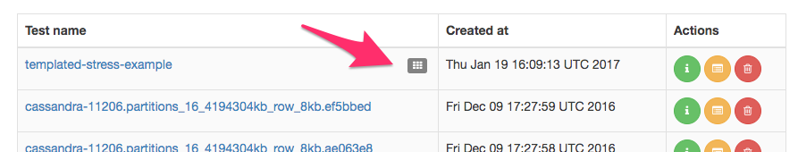

# Templated tests

Fallout supports test definitions with parameterized values that can be changed
for each test run. Fallout uses [Mustache](https://mustache.github.io/) as its templating engine.

For example, the default test definition is templated:
```yaml
namespace: cass-operator
nosqlbench_yaml: cql-iot.yaml
---
ensemble:
    server:
        node.count: 1
        local_files: # required for kubernetes manifests
            - url: https://raw.githubusercontent.com/datastax/fallout/oss-fallout/examples/kubernetes/datastax-cass-operator-resources/ds-cass-operator-v1.yaml
              path: ds-cass-operator.yaml
            - url: https://raw.githubusercontent.com/datastax/fallout/oss-fallout/examples/kubernetes/datastax-cass-operator-resources/kind-default-dc.yaml
              path: kind-cass-dc.yaml
            - url: https://raw.githubusercontent.com/datastax/fallout/oss-fallout/examples/kubernetes/datastax-cass-operator-resources/rancher-local-path-storage.yaml
              path: rancher-local-storage.yaml
        provisioner:
            name: kind
        configuration_manager:
            - name: kubernetes_manifest
              properties:
                  manifest: <<file:rancher-local-storage.yaml>>
                  wait.strategy: FIXED_DURATION
                  wait.timeout: 30s
            - name: ds_cass_operator
              properties:
                  namespace: {{namespace}}
                  operator.manifest: <<file:ds-cass-operator.yaml>>
                  datacenter.manifest: <<file:kind-cass-dc.yaml>>
            - name: nosqlbench
              properties:
                  namespace: {{namespace}}
                  replicas: 1
    client: server

workload:
    phases:
        - init_schema:
              module: nosqlbench
              properties:
                  num_clients: 1
                  args:
                      - run
                      - type=cql
                      - yaml={{nosqlbench_yaml}}
                      - tags=phase:schema
        - benchmark:
              module: nosqlbench
              properties:
                  args:
                      - run
                      - type=cql
                      - yaml={{nosqlbench_yaml}}
                      - tags=phase:main
                      - cycles=100K
                      - errors=histogram
    checkers:
        nofail:
            checker: nofail
    artifact_checkers:
        hdr:
            artifact_checker: hdrtool
```

Note that you _must_ provide default values for all the placeholders.

Clicking **Submit Test** will create a new test, as usual.  However, it will be
marked with a template icon in the test list:



Running the test will show an additional editor panel that allows changing the
values:


You don't have to set all the values; in fact you could clear the editor, and
the test will run using the defaults you set originally. The editor will always
show the current defaults.

`fallout-shared.log` will store the value of the parameters used for the run as
inline YAML:

```text
17:00:10.938 INFO fallout-shared-541 - Test run started for 6c5596c0-bdad-4621-92b0-7e6cb32acb6d

17:00:10.958 INFO fallout-shared-541 - Template params: {version: cassandra-3.3, nodes: 3}

```

## Command line

Tests can be run from the command-line with [the fallout command line
client](`../../fallout-cli`).

## REST API

Tests can be run using the REST API by setting the template params in the `POST`
to `/tests/{test}/runs/api`.  These can be set by any of the following means:

* `POST` a YAML document containing the settings e.g.

```yaml
namespace: other-namespace
```

* `POST` a JSON document containing the settings e.g.

```json
{
  "namespace": "other-namespace"
}
```

* Passing the values as query params to the `POST` URL e.g.

```text
https://FALLOUT-HOST/tests/templated-stress-example/runs/api?version=cassandra-3.3
```
